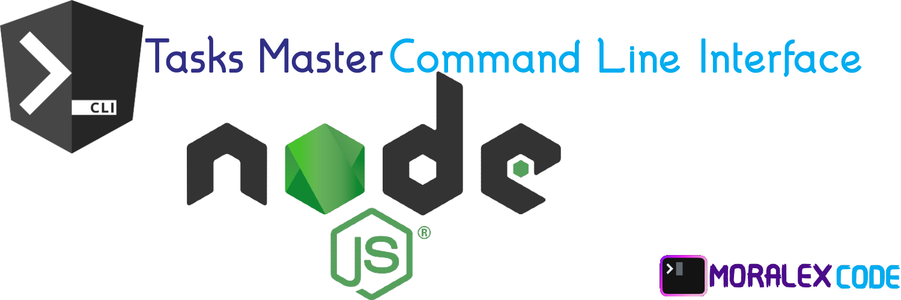

        



# Task Master CLI (⚙️ Building)

This app going to help to take control to your activities following GTD method

To create a NodeJS project, you can follow these steps:

# Feature

    ✓  📦 Create a Node.js APP Project in a seconds
    ✓  🤯 Using mysql with sequelize migrations & seeds
    ✓  📈 Using mysql
    ✓  👤 User CRUD & Jest test
    ✓  👨‍💻 This tool is powered by MoralexCode

<br>

## ⬇️ Install

```sh
# Recommended.
npx task-master-cli

# OR an alternative global install.
npm install cli-todo -g
npm link
```

<br>


run this comand:

```sh
# answer the questions
genesiscli
```

# License

MIT

# Questions

doubts, comments and support, please contact me  by email : [oscarmorales.fullstackdeveloper@gmail.com](oscarmorales.fullstackdeveloper@gmail.com)

 [OSCAR MORALES](https://www.linkedin.com/in/oscar-morales-garcia/)


